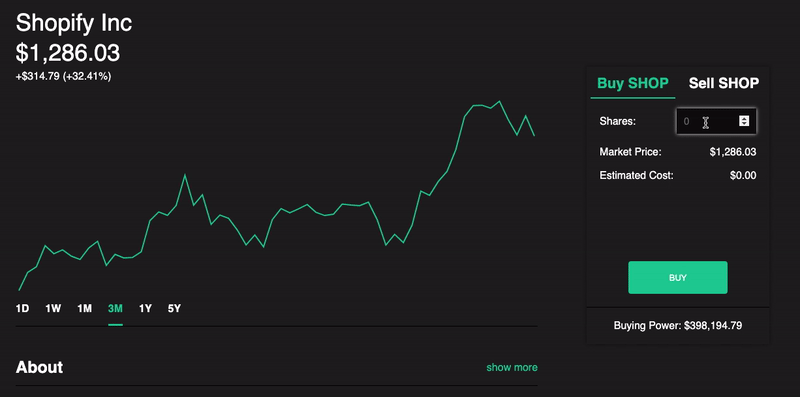
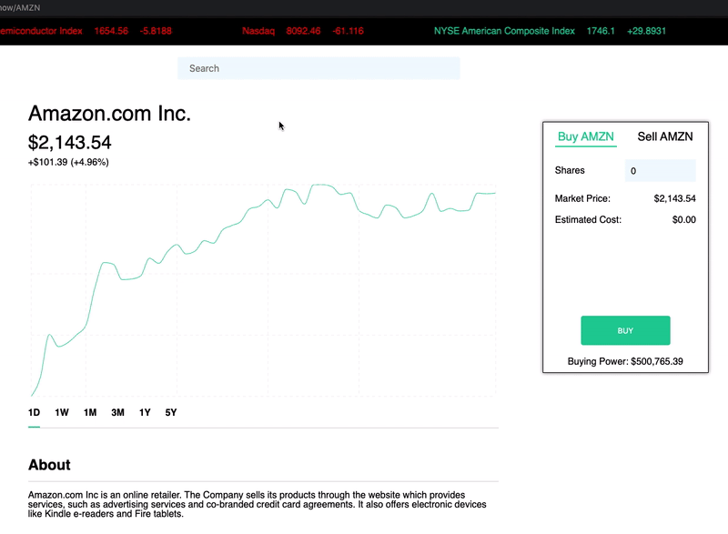

# Cache Out

Cache Out is my own rendition of the popular securities trading app Robinhood. New users can start with up to $10 million in cash, buy or sell shares of over 8,000 companies and various securities, make informed decisions with interactive company graphs and metrics and track their portfolio's performance overtime with up to the minute market data. A great platform for "practice investing"

Here's a link to the [live site](https://cache-out.herokuapp.com/#/)

## Features
* Secure frontend to backend user authentication using the gem BCrypt
* Real-time and historical price data of all stocks traded on the NASDAQ and NYSE exchanges
* Interactive charts displaying a stock's price fluctuation as well as the user's portfolio balance fluctuation over time
* Ability to simulate real stock-market trades by buying and selling shares at the most recent market price
* Ability to search stocks by both their ticker symbol and Company name
* Relevant news displayed for the general market on home page
* A log of the user's overall and security-specific transaction history to see how well certain investments aged

## Portfolio Page
Once a User logs in, they are directed to the portfolio page, which displays a chart showing their portfolio valuation over time and total current assets (total cash + shares held * their current price) above. A list of their holdings is displayed on the right, and below the graph is a financial news feed for the day. 
<br/>
<br/>

<br/>
<br/>
#### Portfolio Snapshots (**newest feature**)
In order to render charts that display a user's portfolio performance over time, 'snapshots' of the users portfolio balance are taken using rake tasks and Heroku Scheduler. Portfolio balance is calculated by looping through each stock they own, multiplying the quantity of shares by the stock's current price, and adding all of that together with their cash at the end. Then, through a simple association between the `User` and `PortfolioSnapshot` models, all of the user's historical portfolio data can easily be fetched

```rb
# 'snapshot'
namespace :scheduler do
  task :add_portfolio_snapshot => :environment do
    require 'date'
    require 'us_bank_holidays'
    require 'time'
    require 'open-uri'

    puts "Adding day's portfolio snapshots..."

    today = Date.today
    next if today.weekend?
    next if today.bank_holiday?
  
    rn = Time.now.getlocal('-05:00')
    market_open = Time.new(rn.year,rn.month,rn.day,9,20,0, "-05:00")
    market_close = Time.new(rn.year,rn.month,rn.day,16,00,0, "-05:00")

    next if rn < market_open
    next if rn > market_close

    users = User.all
    users.each do |user| 
      balance = user.calculate_total_assets
      PortfolioSnapshot.create({ valuation: balance, user_id: user.id })
    end
    
    puts "done."
  end
end
```
```rb
  def calculate_total_assets
    return buying_power if holdings.empty?
    
    prices = {}
    all_holdings = holdings.map { |hold| hold.ticker }.join(",")
    url = "https://financialmodelingprep.com/api/v3/stock/real-time-price/#{all_holdings}?apikey=#{Rails.application.credentials.stockapi[:api_key]}"
    securities = JSON.parse(open(url).read)
    securities["companiesPriceList"].each { |sec| prices[sec['symbol']] = sec["price"] }

    assets = holdings.map { |hold| prices[hold.ticker] * hold.quantity }

    assets.sum + buying_power
  end
```
### Show Page
An Security show page contains current and historical price information data, general company information, relevant news, and allows users to purchase and sell shares of the stock at the most recent market price. 

#### Fetching Security Data

Upon visiting a show page, a variety of API calls are made to fetch the necessary information to render the price charts, the information ('About' section) and relecant news articles. The following APIs are hit
* [Financial Modeling Prep](https://financialmodelingprep.com/) - 4 separate API calls
  * Company Profile (symbol, company name, CEO, industry, etc.)
  * Real Time asset price which continually updates
  * Intraday Price Data (5 minutes historical prices with volume)
* [News API](https://newsapi.org/) - 1 API call

#### Dynamic Chart Rendering
Charts are dynamic and interactive, allowing users to switch between view ranges of **1D**, **1W**, **1M**, **3M**, **1Y**, and **5Y** for individual securities or their overall portfolio. Buttons for each range appear below the chart with click handlers installed, which serve to update the component's local state with the relevant chunk of data. 
<br/>
All of the necessary data is requested when the parent component mounts and child components are not rendered until all the data is present. This makes elegant transitions between pages and graph data rerenders.  

```js
class ShowPage extends React.Component {
  constructor(props) {
    super(props);
    this.state = this.props.profile;
    this.showFinancials = this.showFinancials.bind(this);
  }

  componentDidMount() {
    let creds = {
      user_id: this.props.currentUser.id,
      ticker: this.props.ticker
    }
    this.props.receiveProfile(this.props.ticker);
    this.props.receiveRealTimePrice(this.props.ticker);
    this.props.receiveFinancials(this.props.ticker);
    this.props.receiveDay(`${this.props.ticker}`);
    this.props.receiveWeek(this.props.ticker);
    this.props.receiveHistorical(this.props.ticker);
    this.props.getTransactions(creds);
  }

  // many more class methods... 
}
```

Aside from this minimizing the data returned from expensive external API calls, this switch method helps organize the applications Redux state into a single "graphPrices" slice. If other front end developers were to work on this app with me, it would be very easy to navigate.

### Transaction Validation

No Cheating for my users! You are only allowed to purchase the amount of shares you can afford with your current buying power. Additionally, you are only allowed to sell at maximum the number of shares you own of that particular security. 
<br/>
<br/>
 
<br/>
<br/>
These checks are handled at the model level of my Rails API, and descriptive error messages will be rendered to the page if a user attempts to make an invalid transaction. The form will only submit and trigger a transaction if all model validations pass and no errors are raised.

```rb
class Holding < ApplicationRecord
  validates :ticker, :quantity, :user_id, presence: true
  validates :quantity, numericality: { 
    greater_than_or_equal_to: 0, 
    message: "not enough shares" 
  }

  # more methods ...
end

class User < ApplicationRecord
  validates :email, presence: true
  validates :password_digest, presence: true
  validates :buying_power, presence: true, numericality: { 
    greater_than_or_equal_to: 0, 
    message: "not enough cash" 
  }
  validates :username, :session_token, uniqueness: true, presence: true
  validates :password, length: { minimum: 6, allow_nil: true }

  # many more methods....
end
```

### Search

Users can search for over 8,000 companies and other various securities to purchase across multiple exchanges. Because the navigation element getes reused, this fetch is performed just once when the user signs in. The suggestion logic performed when typing makes sure that exact matches appear at the top.
<br/>
<br/>

<br/>
<br/>
Users may type in any word or symbol in the companies name and, if specific enough, it will populate in the suggestions box. 

### Technologies and Libraries
* Backend: Ruby on Rails/ActiveRecord/PostgreSQL
* Frontend: React.js/Redux.js
* [Financial Modeling Prep API](https://financialmodelingprep.com/)
* [News API](https://newsapi.org/)
* [Recharts](http://recharts.org/en-US/)
* [CSS Animate](http://animate.css)
* [MomentJS](https://momentjs.com/)
* [NumeralJS](http://numeraljs.com/)
